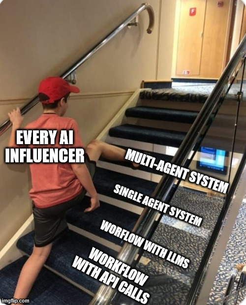

# Python Workflow

As a starting point for any project, we should try to get as far as you can
without the use of LLMs. Don't do this:



Following "good practices" turns out to be really helpful in anticipation for future steps, where
we plan to use LLMs, for example:

- Using structured inputs and outputs.
- Having functions (`tools`) isolated and with clearly defined inputs/outputs.

## Finding surf spots

The example use case we are going to use to guide the workshop is meant
to recommend surf spots around a given location and time.

-> Check [`workflow.py`](../src/find_surf_spots/workflow.py).

-> Check [`openmeteo.py`](../src/find_surf_spots/tools/openmeteo.py).

We can run the test suite, with a mix of unit tests (for the tools):

```console
pytest --disable-warnings -v -s tests/tools
```

-> Check [`test_openmeteo.py`](../tests/tools/test_openmeteo.py).

And a simple integration test for the entire workflow:

```console
pytest --disable-warnings -v -s tests/test_workflow.py
```

-> Check [`test_workflow.py`](../tests/test_workflow.py).

## Deciding on using agents

At this stage:

- The steps that will be executed are fixed.
- We can add breakpoints for debugging at any step.
- We can easily add unit tests.

However, we would like to introduce some features that would be tricky
to implement without using LLMs and/or Agents, like:

- Falling back to do a web search when the existing API calls fail or give no results.
- Search for recommended conditions for a surf spot and compare them to the given forecast.
